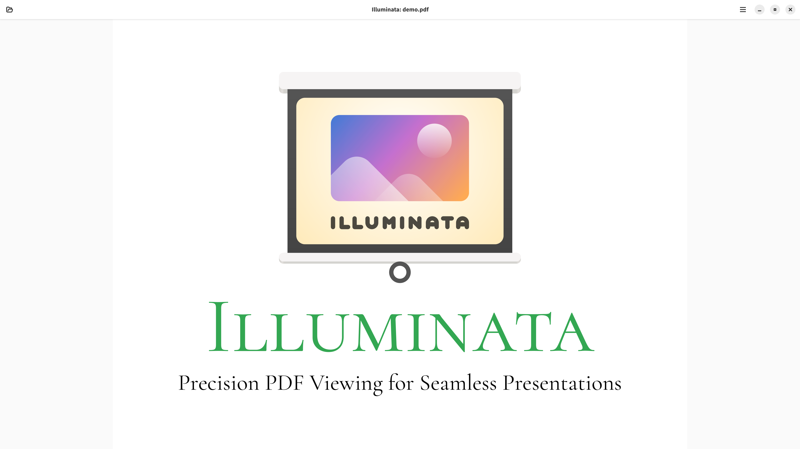
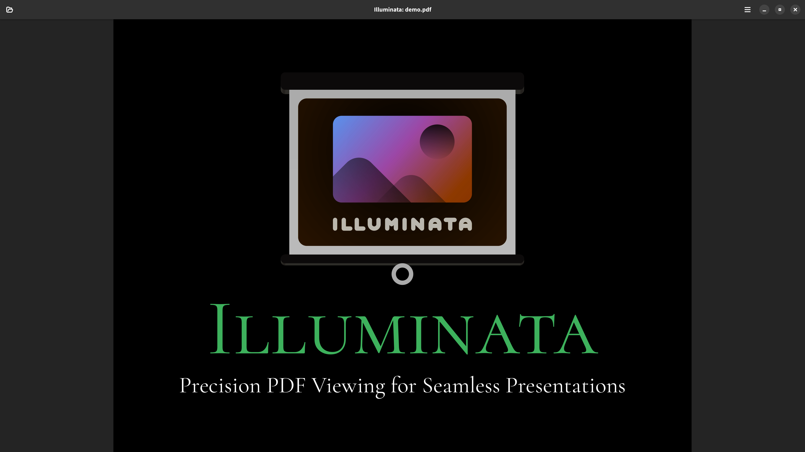

#  Illuminata

A PDF viewer geared towards presentations, featuring support for a full-screen mode, hiding the cursor, panning and zooming, and a dark mode with luminance-only inversion.
It is mainly controlled through keyboard shortcuts, which can be viewed in a shortcuts window, and includes mouse support for panning (movement while clicking the middle button) and zooming (scrolling while holding the control key).
Illuminata uses _GTK_ together with _Adwaita_ for the UI, _MuPDF_ for high-quality PDF rendering, and either `cairomm` or a much more efficient _OpenGL_ implementation (the default) for displaying the rendered PDF.

## Screenshots

Light mode:

Dark mode:

## Dependencies

Illuminata uses the `meson` build system and needs the following dependencies:

- [`gtkmm`](https://www.gtkmm.org), [`libadwaita`](https://gitlab.gnome.org/GNOME/libadwaita), and my fork of [`libadwaitamm`](https://github.com/KurtBoehm/libadwaitamm)
- [`fmtlib`](https://fmt.dev/)
- [`mupdf`](https://mupdf.com/) and, specifically, its C++ wrapper `mupdfcpp`
- When using the OpenGL variant (default): [`epoxy`](https://github.com/anholt/libepoxy)
